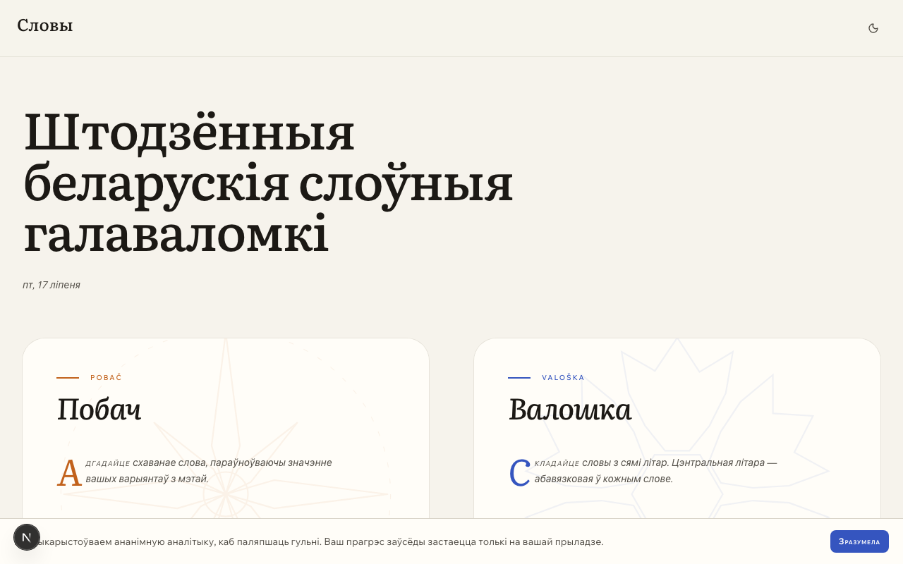
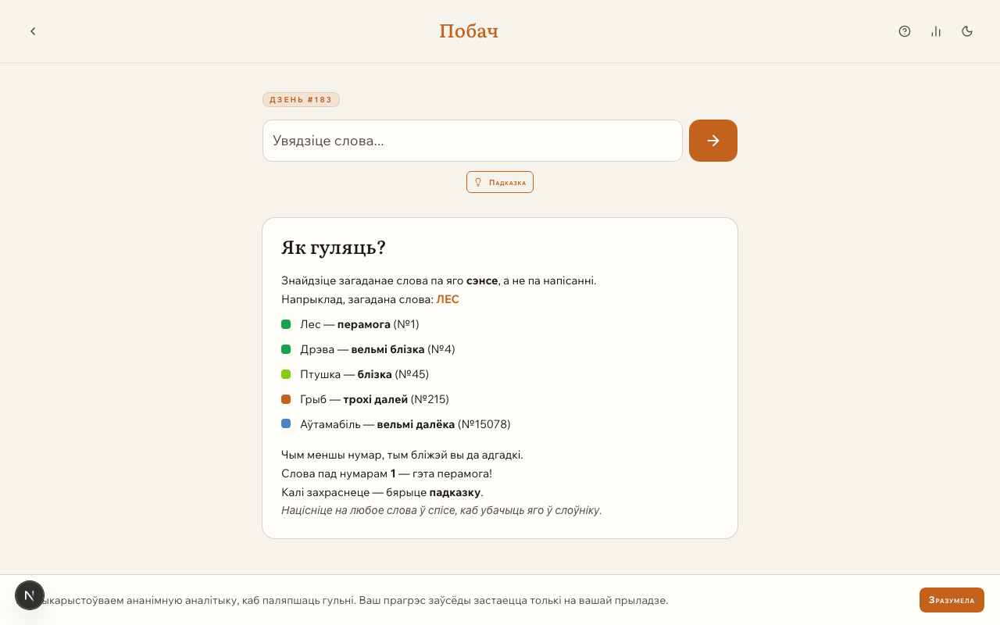
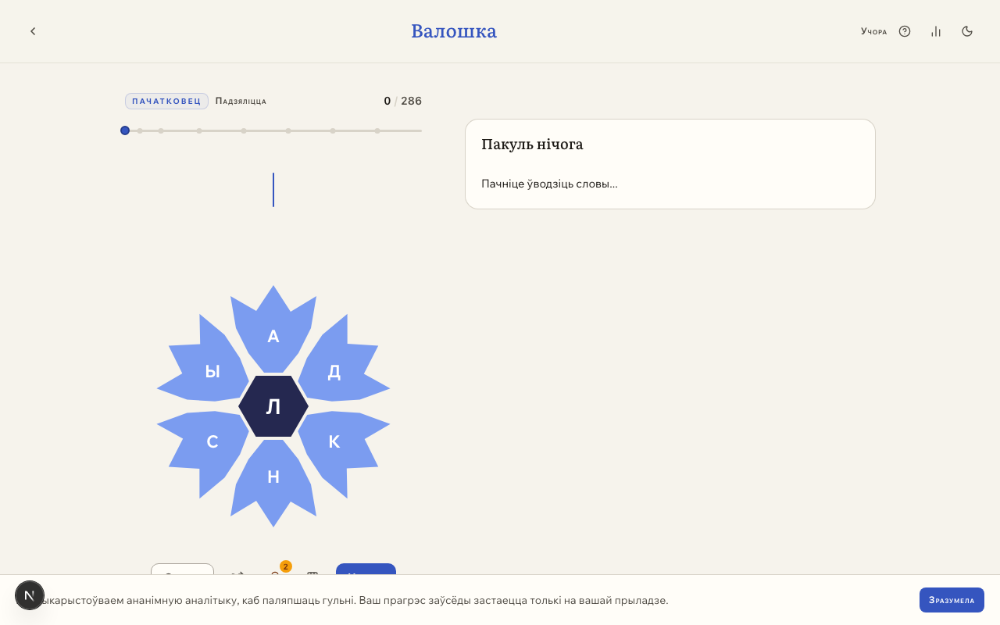

# Словы (slovy.games)

Daily Belarusian word games:
- [Валошка](https://slovy.games/valoshka) (form as many words as possible from a set of letters)
- [Побач](https://slovy.games/pobach) (guess a hidden word by semantic closeness)

Free, no accounts, no tracking of personal data — progress is stored on-device. Built with Next.js.

**Live:** [slovy.games](https://slovy.games)

## Screenshots

| Home | Побач | Валошка |
| --- | --- | --- |
|  |  |  |

## Getting started

```bash
npm install
npm run dev
```

Open [http://localhost:3000](http://localhost:3000).

## Project structure

```
src/
  app/          # Next.js App Router routes (pages, API routes, layouts)
  games/
    pobach/     # "Побач" game: core logic, hooks, providers, components
    valoshka/   # "Валошка" game: puzzle data, hooks, components
  shared/       # Cross-game components, hooks, design tokens, utilities
  data/         # Word lists, targets, and vectors used by the games
scripts/        # Build-time tooling (e.g. data validation)
```

Each game under `src/games/*` owns its domain logic; `src/shared` holds the design system (`Typography`, tokens, etc.) and utilities shared across both games.

## Environment variables

All optional — the app runs without them:

| Variable | Purpose |
| --- | --- |
| `NEXT_PUBLIC_POSTHOG_KEY` | Enables PostHog analytics (only loaded after cookie consent) |

The `/wrapped` deck is gated to its December–January reveal window. It can be opened any time with `?preview=1`, e.g. `/wrapped?preview=1`.

## Design system rules

See [AGENTS.md](./AGENTS.md) for conventions around Typography, design tokens, and Storybook stories — these apply to any UI work in this repo.

## Deployment

Deployed on Vercel at [slovy.games](https://slovy.games) (see `vercel.json`). The build validates game data (`scripts/validate-data.mjs`) before `next build`.
